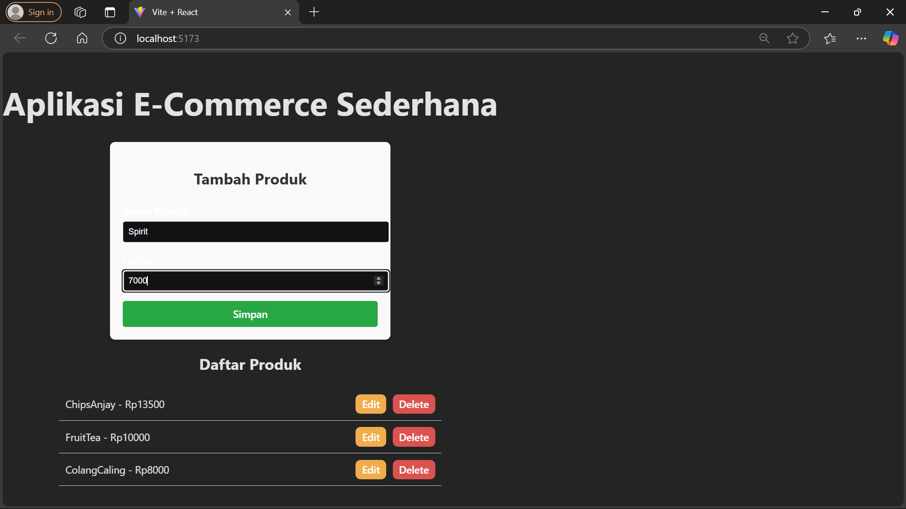
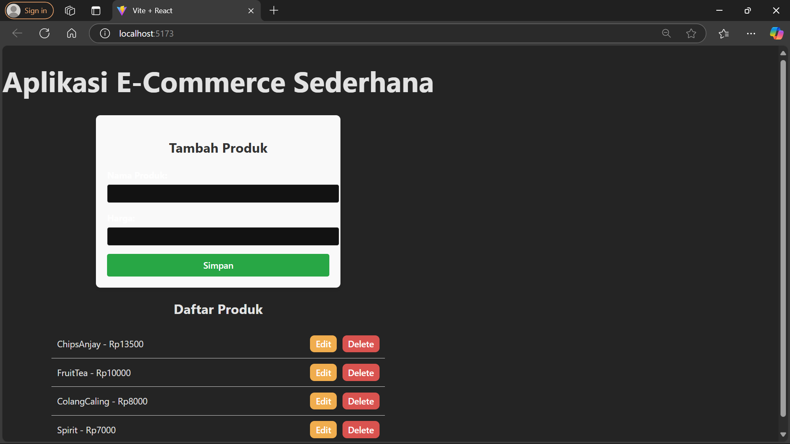
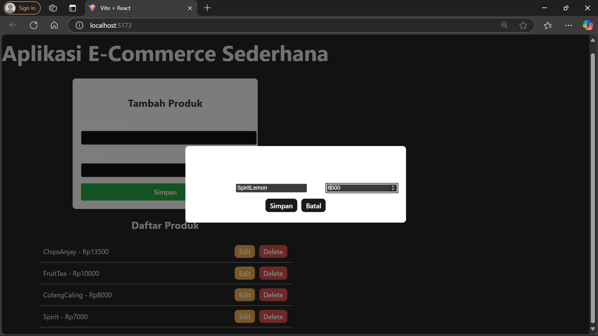
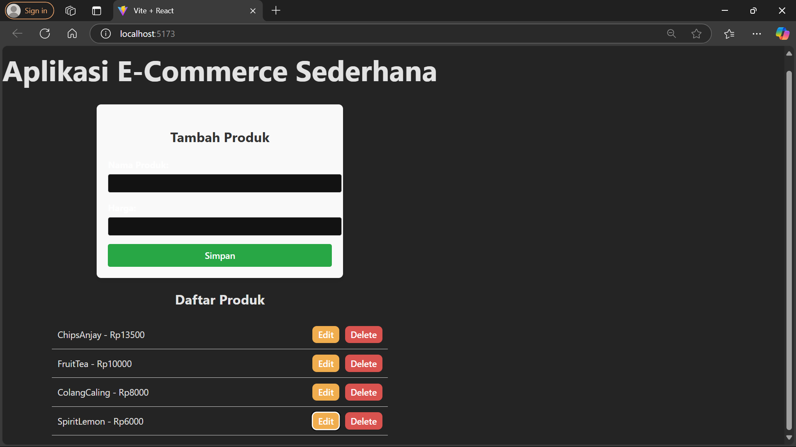
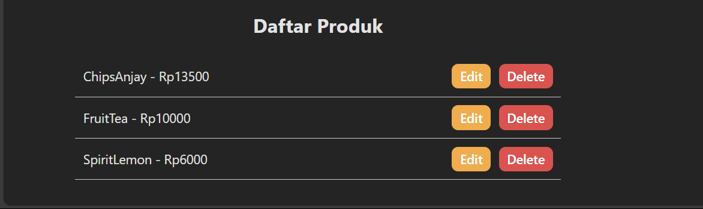

# Aplikasi CRUD dengan React, Express, dan PostgreSQL

Aplikasi ini adalah dashboard admin untuk e-commerce yang memungkinkan pengguna melakukan operasi CRUD terhadap produk. Dilengkapi dengan antarmuka pengguna modern, animasi, dan responsif di berbagai perangkat.


---
## 📌 Fitur Aplikasi
- *Menampilkan daftar produk*
- *Menambahkan produk baru*
- *Mengedit produk yang sudah ada dengan form*
- *Menghapus produk*
- *Menghubungkan frontend dan backend menggunakan API*

---
## 🚀 Cara Install dan Menjalankan Aplikasi

### *1. Clone Repository*
```sh
git clone https://github.com/NorEndGate/ProWeb.git 
cd repository-name
```

### *2. Install Dependensi*
#### *Backend*
```sh
cd backend
npm install
```

#### *Frontend*
```sh
cd frontend
npm install
```

### *3. Konfigurasi Database*
1. Pastikan PostgreSQL sudah terinstall.
2. Buat database dengan nama ecommerce_kecil.
3. Sesuaikan konfigurasi di file db.js.
4. Jalankan migrasi database:
```sh
cd backend
node migrate.js
```

### *4. Menjalankan Aplikasi*
#### *Menjalankan Backend*
```sh
cd backend
node index.js
Backend akan berjalan di http://localhost:3001.
```

#### *Menjalankan Frontend*
```sh
cd frontend
npm run dev

Frontend akan berjalan di http://localhost:5173.
```

---
## 🎨 Teknologi yang Digunakan
- *Frontend:* React (Vite), Tailwind CSS, Axios, React Hooks
- *Backend:* Express.js, Node.js, CORS
- *Database:* PostgreSQL, pgAdmin
- *Tools:* Postman, GitHub, Railway, Vercel
- *State Management:* useState, useEffect, Context API
- *Deployment:* GitHub Actions, Vercel, Railway

---
## 📷 Screenshot Aplikasi
1. *Tampilan Read Data*


2. *Tampilan Create Data*
*Before*

*After*


4. *Tampilan Edit data*
*Before*

*After*


5. *Tampilan Delete Data*


---

## Developed by:
- Rendy Rifandi Kurnia (10231081) FrontEnd & BackEnd Dev (InsyaAllah)
